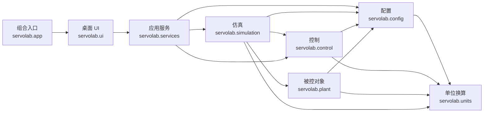

# ServoLab 重构设计与实施计划

## 1. 文档状态

- 状态：已实施并通过自动化验收
- 目标版本：当前 `0.1.0` 代码基线
- 文档范围：`servolab` 包的架构重构，以及相关测试和兼容层
- 核心决定：仿真、控制、模型和应用服务不得依赖桌面 UI，确保未来可复用于 Web、CLI 或其他界面
- 单位决定：位置统一使用 rad，对外速度统一使用 rpm，rad/s 只在物理方程边界显式使用
- 重构前基线：Git 提交 `87ecd38`（`chore: establish pre-refactor baseline`）

### 1.1 实施结果

- 已创建 `config`、`control`、`plant`、`simulation`、`services` 和 `ui` 六个职责子包。
- 仿真引擎通过 `CustomControllerRuntime` Protocol 使用自定义控制器，不再依赖具体进程类。
- `SimulationSession`、实验持久化、数据导出、源码读写及控制器代码生成均可脱离 UI 使用。
- PyQt5 与 pyqtgraph 仅存在于 `servolab/ui/`；旧桌面入口保留为薄兼容模块。
- 当前最大项目 Python 文件为 `servolab/ui/parameter_panel.py`，455 行；最大函数为 `_build_experiment_form`，57 行。
- 使用项目 `venv` 和 `QT_QPA_PLATFORM=offscreen` 完成 31 项自动化测试，全部通过。

## 2. 背景与现状

重构前的 `servolab` 是单层 Python 包。核心算法模块规模尚可，但桌面界面的职责高度集中：

| 文件 | 重构前行数 | 主要问题 |
| --- | ---: | --- |
| `servolab/app.py` | 1358 | `ServoLabWindow` 同时负责界面构建、配置映射、仿真调度、文件操作、控制器代码生成和进程生命周期 |
| `servolab/ui_widgets.py` | 575 | 通用控件、拓扑图、PID 编辑器和完整绘图面板混在同一模块 |
| `servolab/custom_controller.py` | 358 | 控制器代码生成、生成选项和独立进程运行器混在同一模块 |
| `servolab/config.py` | 287 | 配置数据结构、JSON 持久化和旧速度单位迁移位于同一文件 |
| `servolab/simulation.py` | 183 | 仿真引擎直接引用具体的自定义控制器进程实现 |
| `servolab/units.py` | 17 | 新增的无依赖速度单位换算模块，应作为共享基础叶子模块保留 |

重构前有两个函数超过 100 行：`generate_custom_controller_code` 为 180 行，`_build_custom_controller_dialog` 为 147 行。除函数超限外，主要风险来自超长类、职责混合以及桌面 UI 对用例流程的直接控制；这些问题现已通过服务提取和 UI 组件组合消除。

测试基线为 23 个测试。使用项目 `venv` 并设置 `QT_QPA_PLATFORM=offscreen` 时全部通过；系统 Python 未安装 PyQt5/pyqtgraph，会跳过其中 9 个 UI 测试。重构验证统一使用项目 `venv`。

实施前已运行 23 项原有测试并建立 Git 基线提交 `87ecd38`。重构后的新增测试覆盖架构约束和无界面服务用例。

## 3. 重构目标

1. 按配置、控制、被控对象、仿真、应用服务和桌面 UI 划分子包。
2. 所有非 UI 代码不依赖 PyQt5、pyqtgraph 或 `servolab.ui`。
3. 仿真和控制能力通过普通 Python 数据类型与明确接口提供，可直接被 Web、CLI 和测试调用。
4. 桌面 UI 只负责视图展示、用户输入、桌面文件对话框和事件绑定，不承载核心业务规则。
5. 项目自有 Python 文件不超过 500 行，函数和方法不超过 100 行。
6. 保持当前算法、桌面交互、配置格式、启动方式和主要导入路径兼容。
7. 建立自动化架构守卫，防止文件重新膨胀或核心层反向依赖 UI。
8. 固化速度单位契约，保留旧 rad/s 配置自动迁移到 rpm 的行为。

## 4. 非目标

本轮不包含以下工作：

- 不修改 PMSM 数学模型、控制算法或默认参数。
- 不改变当前“位置使用 rad、速度使用 rpm”的产品决定。
- 不重新设计桌面界面的视觉样式和交互流程。
- 不实现 Web 前端、HTTP API 或数据库。
- 不引入异步框架、依赖注入框架或大型分层框架。
- 不在结构重构中夹带功能增强；发现的行为缺陷单独记录和处理。

## 5. 架构原则

### 5.1 依赖方向

依赖只能从外层指向内层。核心层不得知道桌面 UI 的存在。



允许的特殊位置只有组合入口：`servolab.app` 可以导入桌面 UI 并创建应用。兼容模块可以重导出符号，但不得包含业务逻辑。

### 5.2 UI 隔离硬约束

- `PyQt5` 和 `pyqtgraph` 只能在 `servolab/ui/` 及桌面组合入口中导入。
- `servolab.config`、`control`、`plant`、`simulation`、`services` 不得导入 `servolab.ui`。
- 核心接口中不得出现 `QObject`、Qt 信号、Qt 控件或 pyqtgraph 对象。
- 核心层使用 dataclass、Enum、Protocol、普通集合、数值和 `pathlib.Path` 等普通 Python 类型。
- 在未安装 UI 依赖时，核心包仍必须可以导入并完成离线仿真。
- 桌面定时器、窗口生命周期和文件选择对话框属于 UI；步进、复位、离线运行和实验数据操作由无界面服务提供。

### 5.3 单位契约

- 位置、位置指令和位置误差使用 rad。
- 速度、速度指令、速度误差、历史数据及自定义控制器的 `state["omega"]` 使用 rpm。
- 自定义控制器的 `reference["speed"]` 和速度型 `user_input` 使用 rpm。
- 电机电气/机械方程需要角速度时，在方程入口显式从 rpm 转换为 rad/s。
- 加速度写回 `MotorState.omega` 前显式从 rad/s² 转换为 rpm/s。
- 单位换算只能通过 `servolab.units` 中的命名函数或常量完成，禁止在业务模块中散落魔法换算系数。
- JSON 中 `speed_unit="rpm"` 是当前格式标识；缺少该字段的旧配置继续按 rad/s 读取并迁移。
- 轨迹、PID 参数和扰动阈值的旧单位迁移必须集中在配置迁移模块中，不得由 UI 补偿。

### 5.4 以组合代替拆分类继承

不使用多个 mixin 把 `ServoLabWindow` 的方法分散到不同文件。主窗口通过组合以下组件完成工作：

- `ParameterPanel`：参数表单的构建、读取和加载。
- `PlotDashboard`：曲线、通道、游标、叠加曲线和手动给定线。
- `CustomControllerDialog`：代码编辑器、状态展示和编辑器交互。
- `ControllerGeneratorPanel`：生成选项和当前控制上下文展示。
- `SimulationSession`：不依赖 UI 的仿真生命周期和实验状态。
- `ExperimentService`：配置、轨迹和实验数据的读写用例。
- `ControllerGenerationService`：根据当前实验生成可编辑控制器代码。
- `ControllerSourceService`：自定义控制器源码的 UTF-8 读取和保存。

主窗口只协调组件、连接信号并将用户操作转换为应用服务调用。

## 6. 目标目录结构

```text
servolab/
├── __init__.py
├── app.py                         # 桌面组合入口及兼容导出
├── units.py                       # 无依赖的速度单位换算基础模块
├── config/
│   ├── __init__.py                # 保持 servolab.config 的公共导入
│   ├── models.py                  # 配置 dataclass
│   ├── topology.py                # 枚举及拓扑规则
│   ├── serialization.py           # dict/JSON 转换
│   └── migrations.py              # 旧 rad/s 配置迁移到 rpm
├── control/
│   ├── __init__.py
│   ├── types.py                   # ControlOutput、PIDTerms
│   ├── interfaces.py              # 自定义控制输出协议
│   ├── pid.py                     # PIDController
│   ├── servo.py                   # ServoController
│   └── custom_process.py          # 独立进程自定义控制器实现
├── plant/
│   ├── __init__.py
│   ├── motor.py                   # PMSM 状态和模型
│   └── disturbances.py            # 干扰模型
├── simulation/
│   ├── __init__.py                # 保持 servolab.simulation 的公共导入
│   ├── engine.py                  # ServoSimulation
│   ├── commands.py                # 指令与轨迹计算
│   └── history.py                 # 历史记录与 CSV 数据
├── services/
│   ├── __init__.py
│   ├── session.py                 # 无界面仿真会话
│   ├── experiments.py             # 配置和轨迹用例
│   ├── exports.py                 # 数据导出用例
│   ├── controller_generation.py   # 自定义控制器代码生成
│   └── controller_sources.py      # 自定义控制器源码读写
└── ui/
    ├── __init__.py
    ├── application.py             # QApplication 创建和桌面启动
    ├── main_window.py             # 组件协调
    ├── parameter_panel.py         # 参数表单及配置映射
    ├── plot_dashboard.py          # 绘图与游标
    ├── custom_controller_dialog.py
    ├── file_actions.py             # 桌面文件对话框适配
    ├── topology.py                 # 控制拓扑视图
    ├── window_shell.py             # 主窗口静态布局区块
    ├── widgets.py                 # 小型通用控件
    └── theme.py                   # Qt 样式和绘图颜色
```

目录名称是目标边界。实施时允许在不破坏依赖规则和规模限制的前提下微调文件粒度，但新增层级必须有明确职责，不能只为减少行数创建无意义模块。

## 7. 主要接口设计

### 7.1 仿真引擎

`ServoSimulation` 继续提供以下稳定能力：

- 构造、应用配置和复位。
- 单步或多步运行。
- 离线运行并返回 `SimulationHistory`。
- 读取最后采样和历史数据。

引擎不再依赖 `CustomControllerProcess` 具体类。它只依赖 `control.interfaces` 中的 Protocol；独立进程实现由组合层注入。这样 Web 版本可以选择进程实现、远程实现或禁用自定义控制器。

### 7.2 无界面应用服务

`SimulationSession` 统一管理：

- 当前 `ExperimentConfig` 与 `ServoSimulation`。
- 运行、暂停语义所需的状态，但不创建定时器。
- 复位、单步、离线运行和对比快照。
- 自定义控制器启停及接管状态。

服务层返回普通数据或结果对象，不调用消息框、不处理控件、不展示进度条。长任务通过普通进度回调和取消异常与调用方协作。

`ExperimentService` 和 `ExportService` 处理文件内容与路径；文件选择仍由桌面 UI 或未来 Web 上传接口负责。

`ControllerGenerationService` 接收控制方式、参考类型、控制参数、电机参数和生成选项，返回普通 Python 源码字符串。它不得读取控件，也不得启动控制器进程。生成代码中的公开速度变量遵守 rpm 契约。

`ControllerSourceService` 只负责源码内容与持久化路径之间的 UTF-8 读写。是否覆盖未保存内容、选择哪个路径及如何向用户报告错误由外层界面决定。

### 7.3 自定义控制器运行接口

`control.interfaces` 定义仿真引擎所需的最小更新协议。`CustomControllerProcess` 实现该协议，负责子进程、超时、异常跨进程传递和关闭，不再包含代码生成逻辑。

生成代码和运行进程可分别测试。生成的全部控制拓扑与输入类型必须能编译、运行，并继续满足单函数不超过 100 行；当前生成结果的最大 `control` 函数为 69 行。

### 7.4 桌面 UI

桌面 UI 将用户事件转交给服务层，并把服务返回的数据渲染到控件中。30 ms 的 Qt 定时器保留在 UI 层，但每次 tick 只计算需要推进的步数并调用会话服务。

参数面板通过 `load_config(config)` 和 `update_config(config)` 与配置对象交互，主窗口不再逐个读取几十个控件。

## 8. 兼容策略

以下行为必须保持：

- `python main.py` 仍可启动桌面程序。
- `servolab.app.run` 和 `servolab.app.ServoLabWindow` 仍可导入。
- `from servolab.config import ExperimentConfig` 等现有配置导入保持有效。
- `from servolab.simulation import ServoSimulation` 保持有效。
- `servolab.units`、`rpm_to_rad_s` 和 `rad_s_to_rpm` 保持有效。
- `ControllerGenerationOptions` 和 `generate_custom_controller_code` 继续可从 `servolab.custom_controller` 导入。
- 现有 `servolab.controllers`、`motor`、`disturbances`、`commands`、`history`、`custom_controller` 和 `ui_widgets` 可暂时保留为薄兼容模块。
- 兼容模块只能重导出，不复制实现、不产生弃用警告、不引入反向依赖。
- JSON 配置字段、默认值和容错行为保持不变，包括 `speed_unit="rpm"` 和缺少该字段时的旧 rad/s 配置迁移。

兼容模块的最终移除不属于本轮任务，需要单独版本决策。

## 9. 代码规模规则

适用范围为仓库内项目自有 Python 文件，包括 `servolab/`、`tests/` 和 `main.py`；虚拟环境、缓存、构建输出和生成文件除外。

- 文件物理行数必须小于等于 500。
- 函数和方法从定义行到 AST `end_lineno` 必须小于等于 100。
- 日常目标分别为不超过 400 行和 80 行，为后续修改保留空间。
- 类暂不设置机械行数上限，但超长类必须通过职责和组合进行审查。
- 不允许通过压缩代码、合并语句或删除必要空行规避限制。

`tests/test_architecture.py` 已实现以下自动检查：

1. 文件和函数行数。
2. 非 UI 包不导入 PyQt5、pyqtgraph 或 `servolab.ui`。
3. 核心包在没有桌面 UI 依赖的进程中可导入。
4. 桌面兼容模块只包含导入、公共符号声明和必要文档字符串。
5. 生成出的控制器源码中每个函数不超过 100 行。

公开速度字段、历史通道与自定义控制器接口的 rpm 契约由配置、单位、仿真和控制器生成测试共同覆盖。

## 10. 分阶段实施计划

### 阶段 0：建立可回退基线

1. 使用项目 `venv` 和离屏 Qt 环境运行 23 个现有测试并确认全部通过。
2. 记录完整测试结果和当前文件/函数规模。
3. 创建重构前 Git 基线提交。

### 阶段 1：增加行为与架构守卫

1. 增加规模和依赖方向测试。
2. 补充配置 JSON 兼容、旧速度单位迁移、全部控制拓扑和核心包无 UI 导入测试。
3. 增加速度单位契约及生成控制器规模检查。
4. 补充关键 UI 行为的特征测试，锁定现有界面行为。

### 阶段 2：迁移稳定核心模块

1. 保留无依赖的 `units.py`，创建 `config` 和 `plant` 子包。
2. 将旧 rad/s 配置迁移集中到 `config/migrations.py`。
3. 创建 `control` 子包并迁移 PID、串级控制和控制输出类型。
4. 优先进行文件移动和导入调整，不改变实现逻辑。
5. 建立旧导入路径兼容层并运行全部测试。

### 阶段 3：拆分自定义控制器能力

1. 提取控制器更新 Protocol 和独立进程运行器。
2. 将代码生成器和生成选项迁移至 `services/controller_generation.py`。
3. 将源码 UTF-8 读写迁移至 `services/controller_sources.py`。
4. 保持 `servolab.custom_controller` 兼容导出。
5. 验证所有拓扑、输入类型和生成选项的源码均可执行。

### 阶段 4：迁移仿真与通用服务层

1. 创建 `simulation` 子包并保持公共导入路径。
2. 用 Protocol 替代仿真引擎对自定义进程类的直接依赖。
3. 提取 `SimulationSession`、实验读写和导出服务。
4. 使用无 UI 测试验证完整离线用例和 rpm 数据契约。

### 阶段 5：拆分桌面 UI

1. 先拆 `ui_widgets.py`：绘图面板、参数控件和其他小部件分别迁移。
2. 提取参数面板并集中配置映射。
3. 提取自定义控制器对话框和生成选项面板。
4. 将代码生成、源码读写、运行控制和文件动作改为调用服务层。
5. 收缩 `ServoLabWindow`，使其只承担布局和协调职责。

### 阶段 6：兼容、清理与文档同步

1. 保留并验证兼容导入模块。
2. 删除迁移后未使用代码和循环依赖。
3. 更新 README 的架构、单位契约、开发和测试说明。
4. 运行完整测试、结构检查和桌面冒烟测试。

所有阶段已按顺序完成，并在每个职责边界迁移后运行相应测试；最终结果见第 1.1 节。

## 11. 测试与验证策略

### 11.1 每个迁移步骤

- 运行与被移动模块直接相关的单元测试。
- 运行 `python -m unittest discover -s tests -v`。
- 运行文件规模和依赖方向检查。
- 检查旧导入路径。

### 11.2 UI 重构阶段

必须在 `QT_QPA_PLATFORM=offscreen` 下执行全部 UI 自动化测试。以下人工桌面冒烟项目保留为发布前检查清单：

1. 启动、暂停、继续、单步和复位。
2. 切换全部控制拓扑和允许的输入类型。
3. 在线修改 PID 和干扰参数。
4. 运行离线仿真并取消一次运行。
5. 保存及加载实验配置、轨迹、CSV 和 PNG。
6. 按全部拓扑和生成选项生成自定义控制器代码。
7. 打开、保存、覆盖确认、编译、接管、修改和停止自定义控制器。
8. 验证数值字段仅在获得焦点时响应滚轮。
9. 检查曲线游标、通道开关、叠加和手动给定线。

### 11.3 无 UI 可运行验证

在不导入 PyQt5/pyqtgraph 的独立进程中验证：

```python
from servolab.config import ExperimentConfig
from servolab.simulation import ServoSimulation

simulation = ServoSimulation(ExperimentConfig())
simulation.run_offline(0.1)
assert simulation.last_sample
assert simulation.last_sample["speed"] == simulation.motor.state.omega  # rpm
```

该用例是未来 Web、CLI 和后台任务复用核心能力的最低保证。

## 12. 验收标准

重构完成必须同时满足：

- 项目自有 Python 文件全部不超过 500 行。
- 函数和方法全部不超过 100 行。
- 非 UI 包没有 PyQt5、pyqtgraph 或 `servolab.ui` 依赖。
- 没有 UI 依赖时仍可导入核心包并执行离线仿真。
- 全部现有测试及新增架构测试通过，不再以缺少环境为由跳过 UI 测试。
- 所有公开速度字段、自定义控制器输入和历史数据使用 rpm，物理方程边界显式转换为 rad/s。
- 旧 rad/s JSON 配置继续正确迁移，当前 JSON 保存 `speed_unit="rpm"`。
- 全部生成控制器可编译运行，生成源码中的函数不超过 100 行。
- `python main.py` 的窗口构造、步进和关键交互通过离屏 UI 自动化测试；发布前仍需执行第 11.2 节的人工冒烟清单。
- 旧公共导入路径和 JSON 配置格式保持兼容。
- PMSM 模型、控制结果和默认实验行为没有非预期变化。
- README 与最终目录结构一致。

## 13. 风险与控制措施

| 风险 | 控制措施 |
| --- | --- |
| 大量移动导致导入路径破坏 | 先建立兼容导出，再逐步移动；每步运行导入测试 |
| 环境缺少桌面依赖导致 UI 测试被跳过 | 统一使用项目 `venv` 和离屏 Qt 环境锁定行为 |
| 参数表单拆分后在线更新失效 | 为 `load_config`/`update_config` 和在线参数同步增加测试 |
| 自定义控制器进程生命周期回归 | 用协议隔离实现，并覆盖启动、超时、错误和停止流程 |
| 代码生成器和进程运行器再次耦合 | 分属服务层与控制层，通过源码字符串和更新协议连接 |
| rpm/rad/s 重复换算或漏换算 | 固化单位契约、集中换算与迁移，并增加跨模块数值测试 |
| 旧配置被重复迁移 | 只在缺少 rpm 格式标识时迁移，并测试加载后再次保存/加载 |
| 服务层变成 UI 逻辑的转存位置 | 服务层禁止 UI 类型，只表达用例和普通结果 |
| 为满足行数产生碎片化模块 | 以职责和依赖边界决定拆分，400/80 作为目标而非压缩指标 |
| 重构与功能修改混合 | 本轮保持行为；缺陷和增强单独记录、单独实施 |

## 14. 后续扩展方式

完成本轮重构后，Web 版本应作为新的外层适配器实现，例如 `servolab/web/` 或独立项目。它可以直接调用 `servolab.services`、`servolab.simulation` 和 `servolab.config`，而不复制控制算法或导入桌面 UI。

如果未来需要 HTTP、WebSocket 或任务队列，应由 Web 适配器完成协议转换；核心层继续保持同步、无框架绑定的普通 Python API。
